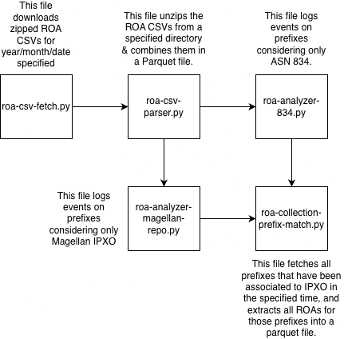

# IPXO ROA Dynamics Analysis

This project analyzes **Resource Public Key Infrastructure (RPKI) Route Origin Authorizations (ROAs)** for prefixes leased via **IPXO**, focusing on the Magellan IPXO platform. ROAs define which Autonomous Systems (ASNs) are authorized to originate a prefix. IPXO frequently issues, updates, or revokes these ROAs to manage leased address space. Our work analyzes and understands these dynamics: how often prefixes are added/removed, which ASNs use IPXO prefixes, and what patterns emerge.

## Objectives

- Measure prefix-level ROA **events** across daily RPKI snapshots:
  - **Creations:** Prefixes newly authorized to AS834 or present in Magellan IPXO repository
  - **Deletions:** Prefixes no longer authorized to AS834/Magellan
  - **Updates:** Prefixes switching authorization between ASNs (to/from IPXO)
- Analyze the **frequency, patterns, and lifetimes** of ROAs for leased prefixes
- Track which ASNs use IPXO-leased prefixes and how the set changes over time

## Background: What is RPKI and ROA?

- **RPKI (Resource Public Key Infrastructure):** A framework for validating the ownership and allocation of Internet number resources (IP prefixes and ASNs)
- **ROA (Route Origin Authorization):** A cryptographic certificate that explicitly authorizes a specific ASN to originate traffic from a specific IP prefix
- **IPXO (AS834):** Internet Public eXchange Organization—a leasing platform offering IPv4/IPv6 prefixes to customers. Each leased prefix is ROA-authorized to the customer's ASN

## Data Flow

Pipeline of files (all in scripts dir) -


```
RIPE NCC RPKI FTP Server
         ↓
[1] roa-csv-fetch.py
    (Download daily .csv.xz snapshots)
         ↓
[2] roa-csv-parser.py
    (Parse & merge into single Parquet file)
         ↓
[3] roa-analyzer-834.py
    (Detect events: creations, deletions, updates)
         ↓
[4] roa-collection-prefix-match.py
    (Extract full ROA history for churned prefixes)
         ↓
[5] roa-visualizer.py
    (Generate timeline plots & statistics)
```

## Project Structure

```
scripts/
├── run_pipeline.sh              # Main orchestration script
├── roa-scripts/
│   ├── roa-csv-fetch.py         # Download RPKI snapshots from Specified Repo
│   ├── roa-csv-parser.py        # Parse .csv.xz files to consolidated Parquet
│   ├── roa-analyzer-834.py      # Track ROA events for AS834
│   ├── roa-analyzer-magellan-repo.py  # Alternative: track events via Magellan URI
│   ├── roa-collection-prefix-match.py # Extract full history of churned prefixes
│   ├── roa-visualizer.py        # Generate timeline plots & statistics
│   └── scatter_all_prefix.py    # Utility for visualization
├── validation-scripts/
│   └── validate-bgp.py          # Validate detected events against BGP data
└── output/                       # Generated data files (Parquets, CSVs)

README.md                          # This file
img/                              # Pipeline diagrams
```

## Prerequisites

```bash
pip install pandas pyarrow requests lzma matplotlib seaborn argparse
```

- **Python 3.7+**
- **pandas, pyarrow** (for Parquet handling)
- **requests** (for downloading from RIPE FTP)
- **matplotlib, seaborn** (for visualization)

## Quick Start

### Option 1: Run Full Pipeline

```bash
cd scripts
sh run_pipeline.sh
```

This executes all 4 steps (download -> parse -> analyze -> visualize) for year 2025. The timeline can be changed in the script.

**Configuration** (edit `run_pipeline.sh`):
- `TARGET_YEAR=2025` - Year to download
- Month and day can be modified in the downloader script call

**Outputs:**
- `output/all_roas_2025.parquet` - Consolidated ROA snapshot data
- `output/event_details.csv` - Detailed log of all ROA events (creation/deletion/update)
- `output/summary_details.csv` - Daily summary counts
- `output/ipxo_roas_2025` - Parquet file of all ROAs for IPXO-related prefixes

### Option 2: Run Individual Steps

#### Step 1: Download ROA Data

```bash
python3 roa-scripts/roa-csv-fetch.py \
    --year 2025 \
    --month 12 \
    --day 01 \
    --dir ./zip_downloads \
    --repo ripencc.tal
```

**Arguments:**
- `--year` - Year to download (e.g., 2025)
- `--month` - Month (1-12, optional; if ommitted, all months for the year are downloaded)
- `--day` - Day (1-31, optional; if omitted, all days in month are downloaded)
- `--dir` - Output directory for .csv.xz files
- `--repo` - Repository (e.g., `ripencc.tal` for RIPE NCC)

#### Step 2: Parse into Parquet

```bash
python3 roa-scripts/roa-csv-parser.py \
    --dir ./zip_downloads \
    --output_dir ./output \
    --output_filename all_roas_2025 \
    --output_type parquet \
    --clean
```

**Arguments:**
- `--dir` - Directory containing .csv.xz files
- `--output_dir` - Output directory
- `--output_filename` - Name of Parquet file (without extension)
- `--output_type` - Format: `parquet` or `csv`
- `--clean` - Delete input files after parsing

#### Step 3: Analyze IPXO Events

```bash
python3 roa-scripts/roa-analyzer-834.py \
    --file ./output/all_roas_2025.parquet \
    --summary_output_file_path ./output/summary_details.csv \
    --detail_output_file_path ./output/event_details.csv
```

**Output columns:**
- `snapshot_date` - Date of snapshot
- `prefix` - IP prefix
- `asn` - Autonomous System Number
- `event_type` - `creation`, `deletion`, or `update`
- Additional metadata

#### Step 4: Extract Prefix History

```bash
python3 roa-scripts/roa-collection-prefix-match.py \
    --prefix_details ./output/event_details.csv \
    --data_file ./output/all_roas_2025.parquet \
    --output_file ./output/ipxo_roas_2025
```

#### Step 5: Visualize Results

```bash
python3 roa-scripts/roa-visualizer.py \
    --prefix <PREFIX_TO_VISUALIZE> \
    --data_file ./output/ipxo_roas_2025 \
    --output_dir ./output/visualize
```

## Alternative: Magellan Repository Analysis

Instead of tracking by ASN (AS834), track by IPXO's Magellan repository URI:

```bash
python3 roa-scripts/roa-analyzer-magellan-repo.py \
    --file ./output/all_roas_2025.parquet \
    --summary_output_file_path ./output/summary_magellan.csv \
    --detail_output_file_path ./output/event_magellan.csv
```

This uses `r.magellan.ipxo.com` as the identifier instead of AS834.

## Validation & Testing

### Validate Detected Events Against BGP Data

```bash
python3 validation-scripts/validate-bgp.py \
    --events ./output/event_details.csv \
    --bgp_data <PATH_TO_BGP_DATA>
```

This cross-references detected ROA events with BGP announcements to validate accuracy.

## Key Findings & Metrics

The analysis tracks:

1. **Event Frequency**: How many prefixes are added/removed daily
2. **ASN Diversity**: How many unique ASNs use IPXO prefixes
3. **ROA Lifetimes**: How long a prefix remains authorized to an ASN
4. **Churn Patterns**: Seasonal trends, clustering, or anomalies

## References

- [RIPE NCC RPKI Repo](https://ftp.ripe.net/rpki/)
- [RPKI Standard (RFC 6811)](https://tools.ietf.org/html/rfc6811)
- [IPXO Leasing Platform](https://ipxo.com/)
